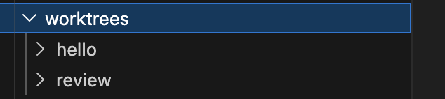

新しく作ったlearning-flowスキルを使ってclaude codeの勉強を行っている。

今日やったこと

1. claudeのコマンドライン上での使用法
いろいろなコマンドがあるらしいことがわかったが、面白そうなのは次の二つで。

`--exclude-dynamic-system-prompt-sections`
非対話(print)モード限定のコマンドだが、system promptから動的情報（現在時刻など）を外すことでキャッシュヒット率を高くする。
claudeではプロンプトキャッシュというものが存在していて、おんなじプロンプトを使用する場合input時の料金が下がる（キャッシュサーバーの計算済みトークンを使用できるからかな？）
で、動的な情報があるとこれのヒット率が下がるということで、動的な情報を抜いた静的システムプロンプトに価値があるということらしい。

`--worktree`
git worktreeのように作業ツリーを分岐させることができる。

こんな感じで.gitみたいに.claude下で管理される。明らかにworktree/<branch>以下でそのままgit cloneしましたみたいな感じで作られているので一気にストレージが重くなる危険性があるかもしれないな

2. skillについて
確かに言われてみると、/clearのようにAIとは異なるレイヤで動くものと/initみたいなAIへの指示は違うものだよね
特に後者のようなものをバンドルスキルというらしい（雑学）
よく使うスキル

/compact はバンドルスキルなので指示が緩く、こんなふうに要約して！のような指示と一緒に行うことが可能らしい

/permissionでは、lsとかのコマンドを常に許可できるautoとapproveの中間みたいなことを設定できる。
設定もめんどくさいなと思ったが、`fewer-permission-prompts` skillを使うと、lsとかの慣れたコマンドを自動で許可するよう書き込んでくれるらしい

/review（[Skill]）— PR レビュー

GitHub PR をレビューする skill。/review <PR#> で対象指定。今のリポジトリには PR 紐づけが必要。

/security-review（[Skill]）— セキュリティレビュー

カレントブランチの変更をセキュリティ視点でレビュー。OWASP Top 10 や認証回り等を見る。

この辺のレビュースキル便利そう。

/simplify（[Skill]）— コード簡素化

変更されたコードをシンプル化する skill。冗長な抽象化、不要な分岐を取り除く。
この辺りも楽そう

/loop / /schedule — 定期実行 & スケジューリング

- /loop — 同じプロンプトを定期実行（/loop 5m /status 等）
- /schedule — cron でスケジュール

定期時